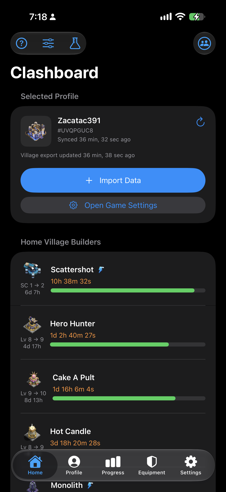
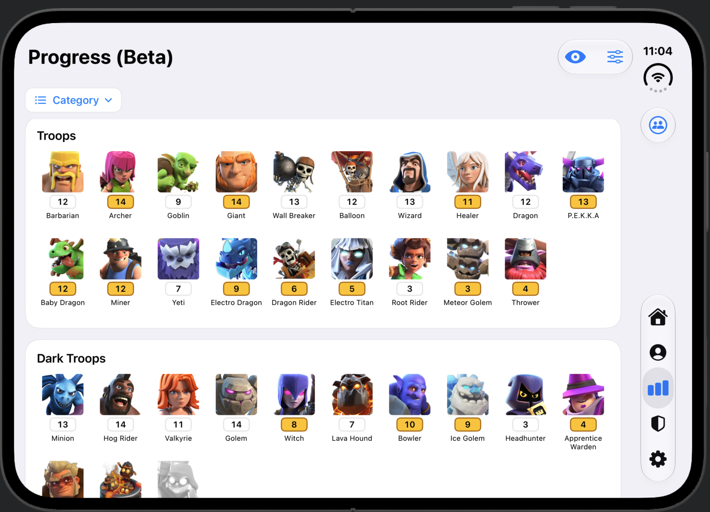
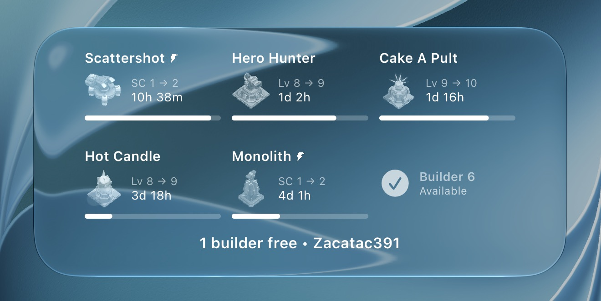
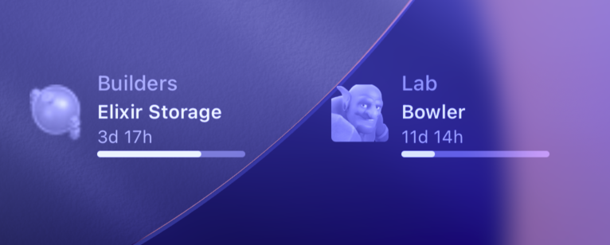

# Clashboard

Keep up with your Clash of Clans villages, upgrades, and equipment on iPhone and iPad.

Clashboard brings your upgrade timers, village progress, hero equipment, and clan war status into one place. Switch between accounts, check what is ready next from your widgets, and share a snapshot of your progress with friends.

## Your village at a glance

- **Upgrade dashboard:** Follow Home Village builders, Laboratory and Pet House upgrades, plus Builder Base builders and the Star Laboratory. See idle builders and remaining wall upgrade costs.
- **Boosts and helpers:** Track helper cooldowns and account for potions, snacks, and custom boost durations. Gold Pass discounts are reflected in supported upgrade costs and timers.
- **Profiles and clan information:** Keep multiple accounts together, switch profiles quickly, and view player details, heroes, clan information, and current war status.
- **Make it yours:** Reorder or hide dashboard sections and profile cards, and use layouts that adapt to iPhone, iPad, and different window sizes.

## See your progress

The **Progress (Beta)** tab shows the current levels of your Home Village troops, spells, heroes, pets, guardians, buildings, traps, walls, and equipment. Jump between categories, arrange your cards, and choose whether to show Supercharges and Crafted Defenses.

Blue level badges show items maxed for your Town Hall; gold badges show items at their overall maximum level.

## Track your hero equipment

View equipment by hero, check upgrade costs and the ores needed to reach maximum level, and focus on the items you actually use. Hidden equipment is excluded from your remaining-cost totals.

## Check in from your widgets

Home Screen widgets cover builders, Laboratory and Pet House upgrades, Builder Base, helper cooldowns, and clan wars. Lock Screen widgets let you check upcoming upgrade completions and war status without opening the app.

Choose a specific profile for a widget, or have it follow the last profile you opened. A Control Center import shortcut also helps you refresh your village data.

**On the Home Screen:** builder countdowns, upgrade progress, and available builders.

**On the Lock Screen:** a quick look at upcoming upgrade completions.

## Share your progress

Open **Share Progress** from the Progress tab to preview your units or equipment on a dedicated canvas. Choose a background and a shape that suits where you want to post:

- Square: **1:1**
- Portrait: **4:5** or **3:4**
- Landscape: **4:3** or **5:4**

Copy the visible page straight to your clipboard or open the usual share sheet. Images are saved as detailed, compressed JPEGs for easy sharing. The canvas stays consistent across devices.

## Get reminders that suit you

Choose notifications separately for each profile and for builders, Laboratory, Pet House, Builder Base, helpers, and clan wars. Set an advance reminder, and optionally open Clash of Clans when you tap a notification. Profile-aware reminders help you return to the right account.

## Getting started

1. In Clash of Clans, open **Settings → More Settings → Data Export** and tap **Copy**.
2. Open Clashboard and follow the setup steps to import your village and add your profile.
3. Add the widgets you want and choose your notification preferences.

Import fresh village data after making changes in-game to keep upgrade tracking and progress up to date. Player and clan details can also be refreshed in the app.

Clashboard supports **iOS and iPadOS 18 or later**.

## About this repository

This repository contains the iOS app, its widgets, and the tools used to maintain game data. For publishing news and events without an app build, see the [remote content guide](documentation/REMOTE_CONTENT.md). For maintenance details, see the [game data and asset update guide](documentation/UPDATE_GUIDE.md), [release procedure](documentation/Clashboard%20Update%20Process.md), and [project organization notes](documentation/PROJECT_ORGANIZATION.md).

Clashboard is a fan-made companion app and is not affiliated with, endorsed, or sponsored by Supercell. Clash of Clans and its game artwork belong to Supercell.
